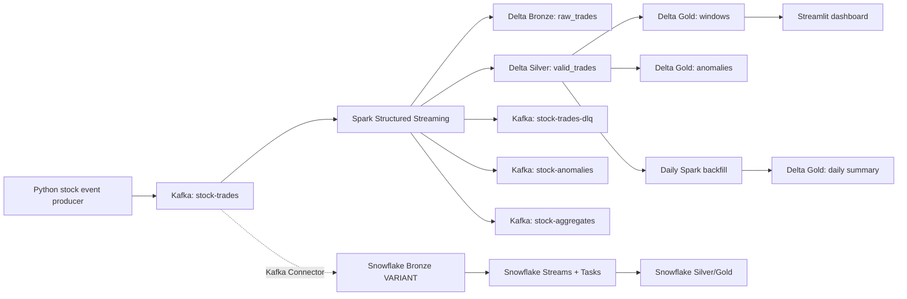

# Real-Time Stock Market Streaming Pipeline

Event-driven data engineering project that simulates stock market buy/sell events, processes them with Kafka and Spark Structured Streaming, detects anomalies in real time, and lands curated outputs in Delta Lake with Snowflake integration assets.

## What This Demonstrates

- Kafka topic design with partitions, keyed ordering, idempotent producers, DLQ routing, and lag checks.
- Spark Structured Streaming with event-time processing, watermarks, deduplication, tumbling windows, sliding windows, and session windows.
- Medallion architecture: bronze raw events, silver validated trades, gold anomaly and aggregate tables.
- At-least-once delivery with idempotent sinks and checkpointed stream state. Delta outputs are exactly-once for the Spark source/sink path; Kafka and Snowflake external sinks are treated as at-least-once and deduped by `trade_id`.
- Backpressure controls through `maxOffsetsPerTrigger`, producer buffering, Kafka retention, and micro-batch trigger intervals.
- Batch plus streaming integration through a daily Spark backfill DAG.
- Optional Snowflake ingestion via Kafka Connector plus Snowflake Streams and Tasks.

## Architecture



## Repository Layout

```text
src/stock_streaming_pipeline/     Python event model, simulator, producer, lag monitor
spark/                           Spark streaming and batch jobs
snowflake/                       Snowflake DDL, Streams/Tasks, Kafka connector template
airflow/dags/                    Batch reconciliation DAG
dashboard/                       Streamlit monitoring dashboard
config/                          Kafka topic and Prometheus config
scripts/                         Local run helpers
tests/                           Unit tests for event validation and anomaly rules
```

## Quick Start

1. Copy the environment template.

   ```powershell
   Copy-Item .env.example .env
   ```

2. Start Kafka, Kafka UI, and Spark.

   ```powershell
   docker compose up -d zookeeper kafka kafka-ui spark-master spark-worker
   docker compose run --rm topic-init
   ```

3. Start the producer in one terminal.

   ```powershell
   docker compose --profile runtime up producer
   ```

4. Start Spark Structured Streaming in another terminal.

   ```powershell
   docker compose exec spark-master spark-submit `
     --master spark://spark-master:7077 `
     --conf spark.jars.ivy=/tmp/.ivy2 `
     --packages org.apache.spark:spark-sql-kafka-0-10_2.12:3.5.1,io.delta:delta-spark_2.12:3.2.0 `
     /opt/stock-pipeline/spark/stock_streaming_job.py
   ```

5. Optional: run the dashboard locally after installing dashboard dependencies.

   ```powershell
   python -m venv .venv
   .\.venv\Scripts\Activate.ps1
   python -m pip install --upgrade pip
   python -m pip install -e ".[dashboard]"
   streamlit run dashboard/streamlit_app.py
   ```

If you already have a Python 3.10-3.12 runtime available, you can also run the producer and Spark submit helper directly on the host:

   ```powershell
   python -m pip install -e ".[dev,streaming,dashboard]"
   python scripts/create_topics.py
   python -m stock_streaming_pipeline.producer --rate 100
   .\scripts\submit_streaming_job.ps1
   ```

Kafka UI runs at [http://localhost:8080](http://localhost:8080). Spark UI runs at [http://localhost:4040](http://localhost:4040) for local Spark jobs.

## Event Model

The producer emits JSON trade events keyed by `symbol`:

```json
{
  "trade_id": "uuid",
  "symbol": "AAPL",
  "side": "BUY",
  "quantity": 500,
  "price": 210.42,
  "event_time": "2026-06-30T20:00:00+00:00",
  "ingest_time": "2026-06-30T20:00:01+00:00",
  "exchange": "NASDAQ",
  "trader_id": "trader-0001",
  "sequence": 123,
  "schema_version": "1.0"
}
```

The simulator intentionally injects:

- Out-of-order events through delayed `event_time` values.
- Bad events such as invalid side, missing symbol, zero price, or negative quantity.
- Market anomalies such as extreme quantity, notional value, or price dislocation.

## Stream Processing Behavior

Spark reads from `stock-trades` and writes:

- `data/delta/bronze/raw_trades`: raw Kafka payloads and offsets.
- `data/delta/silver/valid_trades`: parsed, validated, deduplicated trades.
- `data/delta/gold/anomalies`: high-value or unusual trades.
- `data/delta/gold/tumbling_1m`: one-minute symbol aggregates.
- `data/delta/gold/sliding_5m`: five-minute windows sliding every minute.
- `data/delta/gold/sessions`: symbol sessions with a three-minute inactivity gap.
- `stock-trades-dlq`: invalid records with reason and original payload.
- `stock-anomalies` and `stock-aggregates`: real-time serving topics.

Watermarking is configured with `WATERMARK_DELAY`. The default is `2 minutes`, which allows moderately late stock events to update stateful windows while bounding state growth. Events arriving after the watermark can still be retained in bronze, but they will not reopen finalized aggregate windows.

## Delivery Semantics

The project uses at-least-once ingestion at the system boundary because Kafka-to-Snowflake and Kafka side outputs can be retried. The Spark Kafka source plus checkpointed Delta sink gives exactly-once writes for Delta tables when checkpoints are preserved.

Idempotency is handled by:

- Producer idempotence: `enable.idempotence=true`, `acks=all`.
- Kafka keys by `symbol`, preserving per-symbol partition order.
- Spark checkpointing per sink.
- `dropDuplicates(["trade_id"])` in the silver stream.
- Snowflake `MERGE` statements keyed by `TRADE_ID`.

## Backpressure and Failure Handling

- `MAX_OFFSETS_PER_TRIGGER` caps records per Spark micro-batch.
- `TRIGGER_INTERVAL` controls how often Spark processes each batch.
- Kafka retains input and DLQ topics long enough to replay after outages.
- Invalid records route to `stock-trades-dlq` instead of crashing the stream.
- Producer buffering errors are treated as a backpressure signal and exit non-zero.
- Kafka UI and the lag monitor expose topic depth and consumer lag.

Lag monitor example:

```powershell
python -m stock_streaming_pipeline.lag_monitor --group-id stock-streaming-pipeline --topics stock-trades --json
```

Spark Structured Streaming stores offsets in checkpoint logs, so Kafka consumer-group lag is most accurate for consumers that commit offsets to Kafka. For the Spark job, also inspect Spark UI and checkpoint progress.

## Snowflake Path

The runnable local path uses Delta Lake. The Snowflake folder adds a production cloud-warehouse path:

1. Run `snowflake/01_setup.sql` to create database, schema, warehouse, and medallion tables.
2. Configure Kafka Connect using `snowflake/kafka_connector.properties.template`.
3. Run `snowflake/02_streams_tasks.sql` to transform bronze `VARIANT` data into silver/gold tables.

The Snowflake warehouse uses `AUTO_SUSPEND = 60` and `AUTO_RESUME = TRUE` for cost control.

## Batch Plus Streaming

`spark/batch_backfill_job.py` recomputes daily symbol aggregates from the silver Delta table. The Airflow DAG in `airflow/dags/stock_streaming_quality_dag.py` schedules that reconciliation and validates that expected Delta outputs exist.

This is a lambda-style companion to the streaming job: streaming gives low-latency windows, while batch recomputation gives durable correction and auditability.

## Development Checks

```powershell
python -m unittest discover -s tests -v
python -m pytest
python -m ruff check .
```

## GitHub Portfolio Notes

This project is designed to be reviewed from the repository:

- Start with this README for architecture and tradeoffs.
- Inspect `spark/stock_streaming_job.py` for watermarks, windows, DLQ, dedupe, and sink design.
- Inspect `snowflake/` for warehouse integration and SQL automation.
- Inspect `config/topics.yml` for Kafka partitioning and retention.
- Inspect `tests/` for unit coverage around schema validation and anomaly logic.
