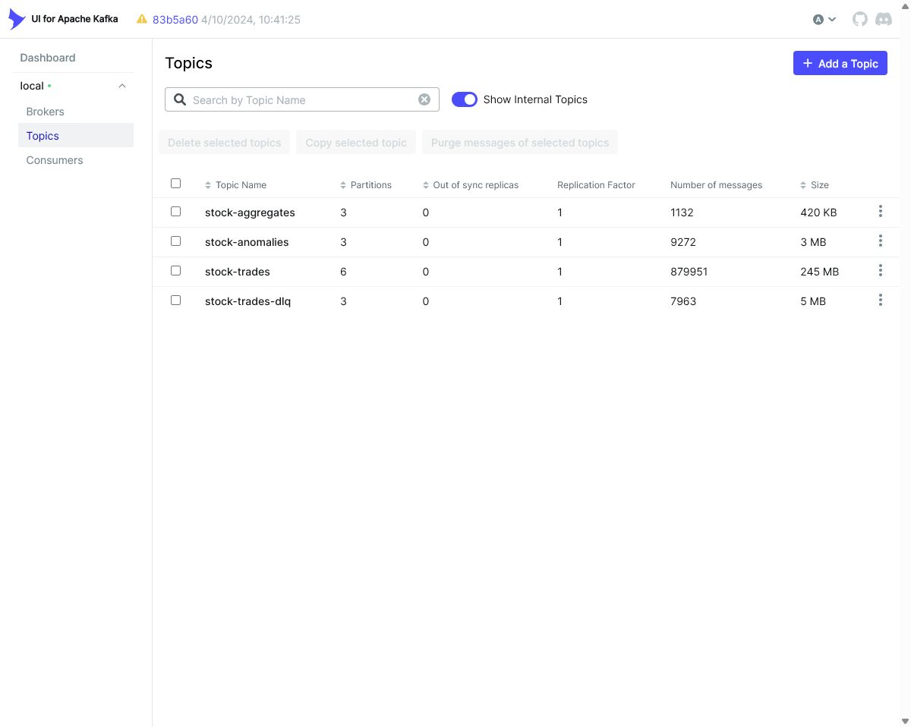
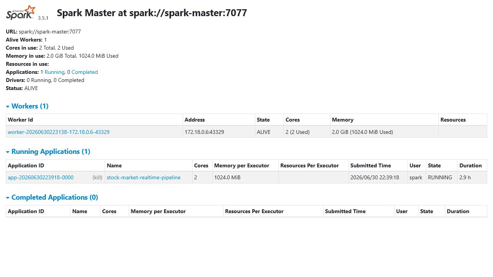
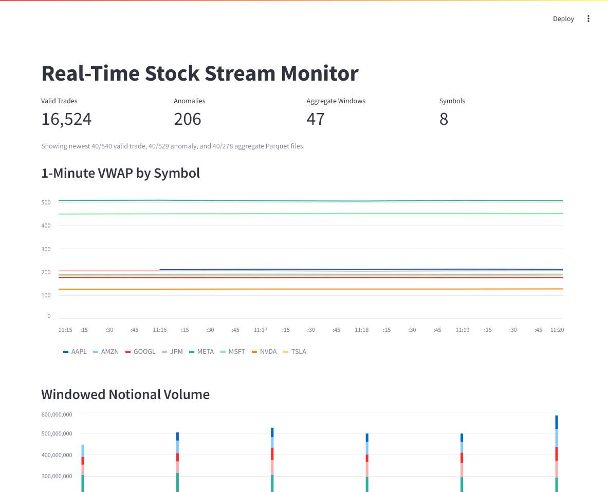

# Demo Evidence

Evidence captured from the local Docker demo on 2026-07-01.

## Running Services

- Kafka UI: `http://localhost:8080`
- Spark Master UI: `http://localhost:8081`
- Streamlit dashboard: `http://localhost:8501`

All three endpoints returned `HTTP 200` during verification.

## Kafka Topic Evidence

Kafka UI showed these live topic counts:

| Topic | Partitions | Messages | Size |
| --- | ---: | ---: | ---: |
| `stock-trades` | 6 | 879,951 | 245 MB |
| `stock-trades-dlq` | 3 | 7,963 | 5 MB |
| `stock-anomalies` | 3 | 9,272 | 3 MB |
| `stock-aggregates` | 3 | 1,132 | 420 KB |

## Spark Evidence

Spark Master UI showed one active worker and one running application:

- Application: `stock-market-realtime-pipeline`
- State: `RUNNING`
- Cores in use: `2`
- Memory in use: `1024.0 MiB`

## Streamlit Dashboard Evidence

The dashboard reads the newest bounded Parquet shards from the local Delta outputs so it remains responsive while Spark continues writing.

Dashboard metrics at capture time:

| Metric | Value |
| --- | ---: |
| Valid trades | 16,524 |
| Anomalies | 206 |
| Aggregate windows | 47 |
| Symbols | 8 |

The dashboard loaded the newest `40/540` valid trade files, `40/529` anomaly files, and `40/278` aggregate files.

## Delta Output Evidence

Local Delta output files existed for every medallion output:

| Delta table | Parquet files | Size |
| --- | ---: | ---: |
| `bronze/raw_trades` | 188 | 24.7 MB |
| `silver/valid_trades` | 544 | 51.0 MB |
| `gold/anomalies` | 533 | 5.9 MB |
| `gold/tumbling_1m` | 282 | 1.1 MB |
| `gold/sliding_5m` | 276 | 0.7 MB |
| `gold/sessions` | 49 | 0.1 MB |

